# Ambient Platform Data Model Spec

**Date:** 2026-03-20
**Status:** Active
**Last Updated:** 2026-05-12 — migrate Credentials from project-scoped to global routes (`/credentials`); remove `project_id` from model, OpenAPI, and SDK; add drop-column migration; update coverage matrix
**Workflow:** `../../workflows/sessions/ambient-model.workflow.md` — implementation waves, gap table, build commands, run log
**Design:** `credentials-session.md` — full Credential Kind design spec and rationale

---

## Overview

The Ambient API server provides a coordination layer for orchestrating fleets of persistent agents across projects. The model is intentionally simple:

- **Project** — a workspace. Groups agents and provides shared context (`prompt`) injected into every agent start.
- **Agent** — a project-scoped, mutable definition. Agents belong to exactly one Project. `prompt` defines who the agent is and is directly editable (subject to RBAC).
- **Session** — an ephemeral Kubernetes execution run, created exclusively via agent start. Only one active Session per Agent at a time.
- **Message** — a single AG-UI event in the LLM conversation. Append-only; the canonical record of what happened in a session.
- **Inbox** — a persistent message queue on an Agent. Messages survive across sessions and are drained into the start context at the next run.
- **Credential** — a global secret. Stores a Personal Access Token or equivalent for an external provider (GitHub, GitLab, Jira, Google, Vertex AI, Kubeconfig). Consumed by runners at session start. Bound to Projects via RoleBindings — a single Credential can be shared across multiple Projects without duplication.
- **RoleBinding** — binds a Role to a subject (user or project) at a given scope. Ownership and access for all Kinds is expressed through RoleBindings. The subject and scope are each represented as typed nullable FKs — exactly one FK is non-null, determined by `scope`.

The stable address of an agent is `{project_name}/{agent_name}`. It holds the inbox and links to the active session.

---

## Entity Relationship Diagram

```mermaid
%%{init: {'theme': 'default', 'themeVariables': {'attributeColor': '#111111', 'lineColor': '#ffffff', 'edgeLabelBackground': '#333333', 'fontFamily': 'monospace'}}}%%
erDiagram

    User {
        string ID PK
        string username
        string name
        string email
        jsonb  labels
        jsonb  annotations
        time   created_at
        time   updated_at
        time   deleted_at
    }

    Project {
        string ID PK "name-as-ID"
        string name
        string description
        string prompt "workspace-level context injected into every agent start"
        jsonb  labels
        jsonb  annotations
        string status
        time   created_at
        time   updated_at
        time   deleted_at
    }

    ProjectSettings {
        string ID PK
        string project_id FK
        string group_access
        string repositories
        time   created_at
        time   updated_at
        time   deleted_at
    }

    %% ── Agent (project-scoped, mutable) ──────────────────────────────────────

    Agent {
        string ID PK "KSUID"
        string project_id FK
        string parent_agent_id FK "nullable — parent agent for sub-agents"
        string owner_user_id FK "user who owns this agent"
        string name "human-readable; unique within project"
        string display_name "nullable — human-friendly display label"
        string description "nullable — purpose description"
        string prompt "who this agent is — mutable; access controlled via RBAC"
        string repo_url "nullable — primary repository for agent sessions"
        string workflow_id "nullable — default workflow for agent sessions"
        string llm_model "active LLM; default claude-sonnet-4-6"
        float  llm_temperature "default 0.7"
        int32  llm_max_tokens "default 4000"
        string bot_account_name "nullable — service account for git ops"
        string resource_overrides "nullable — JSON pod resource overrides"
        string environment_variables "nullable — JSON extra env vars"
        string current_session_id FK "nullable — denormalized for fast reads"
        jsonb  labels
        jsonb  annotations
        time   created_at
        time   updated_at
        time   deleted_at
    }

    %% ── Inbox (queue on Agent — messages waiting for next session) ────────────

    Inbox {
        string ID PK
        string agent_id FK "recipient — project/agent address"
        string from_agent_id FK "nullable — sender; null = human"
        string from_name "denormalized sender display name"
        text   body
        bool   read "false = unread; drained at session start"
        time   created_at
        time   updated_at
        time   deleted_at
    }

    %% ── Session (ephemeral run — created by user or via agent start) ─────────

    Session {
        string  ID PK
        string  name "human-readable display name"
        string  project_id FK "nullable — direct project context (no agent)"
        string  agent_id FK "nullable — set when started via agent ignite"
        string  created_by_user_id FK "who created or started the session"
        string  assigned_user_id FK "nullable — override for session ownership"
        string  parent_session_id FK "nullable — source session for clones"
        string  prompt "task scope for this run"
        string  repo_url "nullable — primary repo for the session"
        string  repos "JSON array of RepoEntry (additional attached repos)"
        string  workflow_id "nullable — JSON-encoded workflow config"
        string  llm_model "active LLM; default claude-sonnet-4-6"
        float   llm_temperature "default 0.7"
        int32   llm_max_tokens "default 4000"
        int32   timeout "nullable — max session duration in seconds"
        string  bot_account_name "nullable — service account for git ops"
        string  resource_overrides "nullable — JSON pod resource overrides"
        string  environment_variables "nullable — JSON extra env vars"
        string  labels "JSON map; queryable tags"
        string  annotations "JSON map; freeform metadata"
        string  phase
        time    start_time
        time    completion_time
        string  kube_cr_name "Kubernetes CR / pod name (set to session ID on create)"
        string  kube_cr_uid
        string  kube_namespace
        string  sdk_session_id
        int32   sdk_restart_count
        string  conditions
        string  reconciled_repos
        string  reconciled_workflow
        time    created_at
        time    updated_at
        time    deleted_at
    }

    %% ── SessionMessage (AG-UI event stream — real LLM turns) ─────────────────

    SessionMessage {
        string ID PK
        string session_id FK
        int    seq "monotonic within session"
        string event_type "user | assistant | tool_use | tool_result | system | error"
        string payload "message body or JSON-encoded event"
        time   created_at
    }

    %% ── RBAC ─────────────────────────────────────────────────────────────────

    Role {
        string ID PK
        string name
        string display_name
        string description
        jsonb  permissions
        bool   built_in
        time   created_at
        time   updated_at
        time   deleted_at
    }

    RoleBinding {
        string ID PK
        string role_id FK
        string scope         "global | project | agent | session | credential"
        string user_id FK    "nullable — set when scope identifies a user subject"
        string project_id FK "nullable — set when scope=project"
        string agent_id FK   "nullable — set when scope=agent"
        string session_id FK "nullable — set when scope=session"
        string credential_id FK "nullable — set when scope=credential"
        time   created_at
        time   updated_at
        time   deleted_at
    }

    %% ── Credential (global PAT/token store, bound via RoleBindings) ──────────

    Credential {
        string ID PK "KSUID"
        string name "human-readable; globally unique"
        string description
        string provider "github | gitlab | jira | google | vertex | kubeconfig"
        string token "write-only; stored encrypted"
        string url "nullable; service instance URL"
        string email "nullable; required for Jira"
        jsonb  labels
        jsonb  annotations
        time   created_at
        time   updated_at
        time   deleted_at
    }

    %% ── ScheduledSession (project-scoped recurring agent trigger) ──────────

    ScheduledSession {
        string ID PK "KSUID"
        string project_id FK
        string agent_id FK "nullable — which Agent to ignite on each trigger"
        string name "human-readable; unique within project"
        string description
        string schedule "cron expression"
        string timezone "IANA timezone; default UTC"
        bool   enabled "false = suspended; schedule not evaluated"
        string session_prompt "injected as Session.prompt on each trigger"
        int32  timeout "nullable — max session duration in seconds for triggered sessions"
        int32  inactivity_timeout "nullable — idle timeout in seconds"
        bool   stop_on_run_finished "nullable — stop session when run completes"
        string runner_type "nullable — override runner type for triggered sessions"
        time   last_run_at "nullable; wall-clock time of last trigger"
        time   next_run_at "nullable; computed from schedule + timezone"
        time   created_at
        time   updated_at
        time   deleted_at
    }

    %% ── Relationships ────────────────────────────────────────────────────────

    Project         ||--o{ ProjectSettings  : "has"
    Project         ||--o{ Agent            : "owns"
    RoleBinding     }o--o| Credential       : "credential_id"
    Project         ||--o{ ScheduledSession : "owns"

    User            }o--o{ RoleBinding      : "user_id"
    Project         }o--o{ RoleBinding      : "project_id"

    RoleBinding     }o--o| Agent            : "agent_id"
    RoleBinding     }o--o| Session          : "session_id"

    Agent           ||--o{ Session          : "runs"
    Agent           ||--o| Session          : "current_session"
    Agent           ||--o{ Inbox            : "receives"
    Agent           ||--o{ ScheduledSession : "scheduled_by"

    Inbox           }o--o| Agent            : "sent_from"

    Session         ||--o{ SessionMessage   : "streams"

    Role            ||--o{ RoleBinding      : "granted_by"
```



---

## Agent — Project-Scoped Mutable Definition

Agent is scoped to a Project. The stable address is `{project_name}/{agent_name}`.

| Field | Notes |
|-------|-------|
| `name` | Human-readable, unique within the project. Used as display name and in addressing. |
| `display_name` | Nullable. Human-friendly label for UI display; does not affect addressing. |
| `description` | Nullable. Free-text purpose description. |
| `prompt` | Defines who the agent is. Mutable via PATCH. Access controlled by RBAC (`agent:editor` or higher). |
| `parent_agent_id` | Nullable FK. Set when this agent was spawned as a sub-agent by another agent. |
| `owner_user_id` | FK to the User who owns this agent. Set at creation; matches the authenticated caller. |
| `repo_url` | Nullable. Primary repository URL cloned into every session the agent starts. Copied to `Session.repo_url` on ignite. |
| `workflow_id` | Nullable. Default workflow identifier injected into sessions. Copied to `Session.workflow_id` on ignite. |
| `llm_model` | Active LLM model name. Default: `claude-sonnet-4-6`. Copied to `Session.llm_model` on ignite. |
| `llm_temperature` | LLM sampling temperature. Default: `0.7`. Copied to `Session.llm_temperature` on ignite. |
| `llm_max_tokens` | Max tokens per LLM response. `int32`, default: `4000`. Copied to `Session.llm_max_tokens` on ignite. |
| `bot_account_name` | Nullable. Service account name for git operations inside sessions. Copied to `Session.bot_account_name` on ignite. |
| `resource_overrides` | Nullable. JSON-encoded pod resource requests/limits override for sessions spawned by this agent. Copied to `Session.resource_overrides` on ignite. |
| `environment_variables` | Nullable. JSON-encoded extra environment variables injected into session pods. Copied to `Session.environment_variables` on ignite. |
| `current_session_id` | Denormalized FK to the active Session. Null when no session is running. Used by Project Home for fast reads. |

**Agent is mutable.** PATCH updates in place. There is no versioning. If you need to track prompt history, use `labels`/`annotations` or an external audit log.

**Field propagation on ignite:** When `POST /agents/{id}/start` creates a new Session, the `ignite_handler` copies `repo_url`, `workflow_id`, `llm_model`, `llm_temperature`, `llm_max_tokens`, `bot_account_name`, `resource_overrides`, and `environment_variables` from the Agent to the new Session. Fields set directly in the start request body override these defaults.

```
POST /projects/{id}/agents          → create agent in this project
PATCH /projects/{id}/agents/{id}    → update agent (name, prompt, labels, annotations)
GET /projects/{id}/agents/{id}      → read agent
DELETE /projects/{id}/agents/{id}   → soft delete
```

Only one active Session per Agent at a time. Start is idempotent — if an active session exists, start returns it. If not, a new session is created.

---

## Inbox — Persistent Message Queue

Inbox messages are addressed to an Agent (`agent_id`). They are distinct from Session Messages:

| | Inbox | SessionMessage |
|--|-------|----------------|
| Scope | Agent (persists across sessions) | Session (ephemeral) |
| Created by | Human or another Agent | LLM turn / runner gRPC push |
| Drained | At session start | Never — append-only stream |
| Purpose | Queued intent waiting for next run | Real LLM event stream |

At session start, all unread Inbox messages are drained: marked `read=true` and injected as context into the Session prompt before the first SessionMessage turn.

---

## Session — Ephemeral Run

Sessions are **not directly creatable**. They are run artifacts created exclusively via `POST /projects/{project_id}/agents/{agent_id}/start`.

`Session.prompt` scopes the task for this specific run — separate from `Agent.prompt` which defines who the agent is.

```
Project.prompt  → "This workspace builds the Ambient platform API server in Go."
Agent.prompt    → "You are a backend engineer specializing in Go APIs..."
Inbox messages  → "Please also review the RBAC middleware while you're in there"
Session.prompt  → "Implement the session messages handler. Repo: github.com/..."
```

All four are assembled into the start context in that order. Pokes roll downhill.

---

## SessionMessage — AG-UI Event Stream

SessionMessages are the real LLM conversation. They are appended by the runner via gRPC `PushSessionMessage` and streamed to clients via SSE.

`seq` is monotonically increasing within a session. `event_type` follows the AG-UI protocol: `user`, `assistant`, `tool_use`, `tool_result`, `system`, `error`.

SessionMessages are never deleted or edited. They are the canonical record of what happened in a session.

### Two Event Streams

| Endpoint | Source | Persistence | Purpose |
|---|---|---|---|
| `GET /sessions/{id}/messages` | API server gRPC fan-out | Persisted in DB (replay from `seq=0`) | Durable stream; supports replay and history |
| `GET /sessions/{id}/events` | Runner pod SSE (`GET /events/{thread_id}`) | Ephemeral; runner-local in-memory queue | Live AG-UI turn events during an active run |

The runner's `/events/{thread_id}` endpoint registers an asyncio queue into `bridge._active_streams[thread_id]` and streams every AG-UI event as SSE until `RUN_FINISHED` / `RUN_ERROR` or client disconnect. The API server's `/sessions/{id}/events` proxies this from the runner pod for the active session, routing via pod IP or session service. Keepalive pings fire every 30s to hold the connection open.

---

## ScheduledSession — Recurring Agent Trigger

A `ScheduledSession` is a project-scoped definition that ignites an Agent on a recurring cron schedule. Each trigger creates a new Session with `session_prompt` injected as the task scope for that run.

| Field | Notes |
|-------|-------|
| `name` | Human-readable, unique within the project. |
| `agent_id` | Which Agent to ignite. Must exist in the same project. |
| `schedule` | Standard cron expression (e.g. `"0 9 * * 1-5"` = 9 AM on weekdays). |
| `timezone` | IANA timezone string (e.g. `"America/New_York"`). Defaults to `UTC`. |
| `enabled` | `false` suspends evaluation without deleting the schedule. |
| `session_prompt` | Injected as `Session.prompt` on each trigger — the recurring task. |
| `last_run_at` | Wall-clock time of the last trigger. Null if never triggered. |
| `next_run_at` | Computed from `schedule` + `timezone`. Updated after each trigger. |

**Trigger semantics:** Each trigger calls `POST /projects/{id}/agents/{agent_id}/start`, which is idempotent. If the Agent already has an active Session at trigger time, the trigger is skipped and recorded as a missed run in the runs list.

**Manual trigger:** `POST .../trigger` ignites the Agent immediately outside the cron schedule, using the same `session_prompt`. Useful for testing or one-off runs.

**Suspend / Resume:** `POST .../suspend` sets `enabled=false`; `POST .../resume` sets `enabled=true`. These are named convenience actions equivalent to `PATCH {enabled: false|true}`.

---

## CLI Reference (`acpctl`)

The `acpctl` CLI mirrors the API 1-for-1. Every REST operation has a corresponding command.

### API ↔ CLI Mapping

#### Projects

| REST API | `acpctl` Command | Status |
|---|---|---|
| `GET /projects` | `acpctl get projects` | ✅ implemented |
| `GET /projects/{id}` | `acpctl get project <name>` | ✅ implemented |
| `POST /projects` | `acpctl create project --name <n> [--description <d>]` | ✅ implemented |
| `PATCH /projects/{id}` | `acpctl project update [--name <n>] [--description <d>] [--prompt <p>]` | ✅ implemented |
| `DELETE /projects/{id}` | `acpctl delete project <name>` | ✅ implemented |
| _(context switch)_ | `acpctl project <name>` | ✅ implemented |
| _(context view)_ | `acpctl project current` | ✅ implemented |

#### Agents (Project-Scoped)

| REST API | `acpctl` Command | Status |
|---|---|---|
| `GET /projects/{id}/agents` | `acpctl agent list --project-id <p>` | ✅ implemented |
| `GET /projects/{id}/agents/{agent_id}` | `acpctl agent get --project-id <p> --agent-id <id>` | ✅ implemented |
| `POST /projects/{id}/agents` | `acpctl agent create --project-id <p> --name <n> [--prompt <p>]` | ✅ implemented |
| `PATCH /projects/{id}/agents/{agent_id}` | `acpctl agent update --project-id <p> --agent-id <id> [--name <n>] [--prompt <p>]` | ✅ implemented |
| `DELETE /projects/{id}/agents/{agent_id}` | `acpctl agent delete --project-id <p> --agent-id <id> --confirm` | ✅ implemented |
| `POST /projects/{id}/agents/{agent_id}/start` | `acpctl start <agent-id> --project-id <p> [--prompt <t>]` | ✅ implemented |
| `GET /projects/{id}/agents/{agent_id}/start` | `acpctl agent start-preview --project-id <p> --agent-id <id>` | ✅ implemented |
| `GET /projects/{id}/agents/{agent_id}/sessions` | `acpctl agent sessions --project-id <p> --agent-id <id>` | ✅ implemented |
| `GET /projects/{id}/agents/{agent_id}/inbox` | `acpctl inbox list --project-id <p> --pa-id <id>` | ✅ implemented |
| `POST /projects/{id}/agents/{agent_id}/inbox` | `acpctl inbox send --project-id <p> --pa-id <id> --body <text>` | ✅ implemented |
| `PATCH /projects/{id}/agents/{agent_id}/inbox/{msg_id}` | `acpctl inbox mark-read --project-id <p> --pa-id <id> --msg-id <id>` | ✅ implemented |
| `DELETE /projects/{id}/agents/{agent_id}/inbox/{msg_id}` | `acpctl inbox delete --project-id <p> --pa-id <id> --msg-id <id>` | ✅ implemented |

#### Sessions

| REST API | `acpctl` Command | Status |
|---|---|---|
| `GET /sessions` | `acpctl get sessions` | ✅ implemented |
| `GET /sessions` | `acpctl get sessions -w` | ✅ implemented (gRPC watch) |
| `GET /sessions/{id}` | `acpctl get session <id>` | ✅ implemented |
| `GET /sessions/{id}` | `acpctl describe session <id>` | ✅ implemented |
| `DELETE /sessions/{id}` | `acpctl delete session <id>` | ✅ implemented |
| `GET /sessions/{id}/messages` | `acpctl session messages <id>` | ✅ implemented |
| `POST /sessions/{id}/messages` | `acpctl session send <id> <message>` | ✅ implemented |
| `POST /sessions/{id}/messages` + `GET /sessions/{id}/events` | `acpctl session send <id> <message> -f` | ✅ implemented |
| `POST /sessions/{id}/messages` + `GET /sessions/{id}/events` | `acpctl session send <id> <message> -f --json` | ✅ implemented |
| `GET /sessions/{id}/events` | `acpctl session events <id>` | ✅ implemented |

#### ScheduledSessions (Project-Scoped)

| REST API | `acpctl` Command | Status |
|---|---|---|
| `GET /projects/{id}/scheduled-sessions` | `acpctl scheduled-session list` | ✅ implemented |
| `GET /projects/{id}/scheduled-sessions/{sched_id}` | `acpctl scheduled-session get <name>` | ✅ implemented |
| `POST /projects/{id}/scheduled-sessions` | `acpctl scheduled-session create --name <n> --agent-id <a> --schedule <cron> [--prompt <p>] [--timezone <tz>]` | ✅ implemented |
| `PATCH /projects/{id}/scheduled-sessions/{sched_id}` | `acpctl scheduled-session update <name> [--schedule <cron>] [--prompt <p>] [--enabled=false]` | ✅ implemented |
| `DELETE /projects/{id}/scheduled-sessions/{sched_id}` | `acpctl scheduled-session delete <name> --confirm` | ✅ implemented |
| `POST .../suspend` | `acpctl scheduled-session suspend <name>` | ✅ implemented |
| `POST .../resume` | `acpctl scheduled-session resume <name>` | ✅ implemented |
| `POST .../trigger` | `acpctl scheduled-session trigger <name>` | ✅ implemented |
| `GET .../runs` | `acpctl scheduled-session runs <name>` | ✅ implemented |

#### Session Operations

| REST API | `acpctl` Command | Status |
|---|---|---|
| `GET /sessions/{id}/workspace` | `acpctl session workspace list <id>` | 🔲 planned |
| `GET /sessions/{id}/workspace/*path` | `acpctl session workspace get <id> <path>` | 🔲 planned |
| `PUT /sessions/{id}/workspace/*path` | `acpctl session workspace put <id> <path> [--file <f>]` | 🔲 planned |
| `DELETE /sessions/{id}/workspace/*path` | `acpctl session workspace delete <id> <path>` | 🔲 planned |
| `GET /sessions/{id}/files` | `acpctl session files list <id>` | 🔲 planned |
| `PUT /sessions/{id}/files/*path` | `acpctl session files upload <id> <path> [--file <f>]` | 🔲 planned |
| `DELETE /sessions/{id}/files/*path` | `acpctl session files delete <id> <path>` | 🔲 planned |
| `GET /sessions/{id}/git/status` | `acpctl session git status <id>` | 🔲 planned |
| `POST /sessions/{id}/git/configure-remote` | `acpctl session git configure-remote <id>` | 🔲 planned |
| `GET /sessions/{id}/git/branches` | `acpctl session git branches <id>` | 🔲 planned |
| `GET /sessions/{id}/repos/status` | `acpctl session repos list <id>` | 🔲 planned |
| `POST /sessions/{id}/repos` | `acpctl session repos add <id> --repo <url>` | 🔲 planned |
| `DELETE /sessions/{id}/repos/{name}` | `acpctl session repos remove <id> <repo>` | 🔲 planned |
| `POST /sessions/{id}/clone` | `acpctl session clone <id> [--name <n>]` | 🔲 planned |
| `POST /sessions/{id}/model` | `acpctl session model <id> --model <m>` | 🔲 planned |
| `GET /sessions/{id}/export` | `acpctl session export <id>` | 🔲 planned |
| `GET /sessions/{id}/pod-events` | `acpctl session pod-events <id>` | 🔲 planned |
| `GET /sessions/{id}/tasks` | `acpctl session tasks <id>` | 🔲 planned |
| `POST /sessions/{id}/tasks/{task_id}/stop` | `acpctl session tasks stop <id> <task-id>` | 🔲 planned |
| `GET /sessions/{id}/tasks/{task_id}/output` | `acpctl session tasks output <id> <task-id>` | 🔲 planned |

#### Credentials (Global)

| REST API | `acpctl` Command | Status |
|---|---|---|
| `GET /credentials` | `acpctl credential list [--provider <p>]` | ✅ implemented |
| `POST /credentials` | `acpctl credential create --name <n> --provider <p> --token <t\|@->  [--url <u>] [--email <e>] [--description <d>]` | ✅ implemented |
| `GET /credentials/{cred_id}` | `acpctl credential get <id>` | ✅ implemented |
| `PATCH /credentials/{cred_id}` | `acpctl credential update <id> [--token <t>] [--description <d>]` | ✅ implemented |
| `DELETE /credentials/{cred_id}` | `acpctl credential delete <id> --confirm` | ✅ implemented |
| `GET /credentials/{cred_id}/token` | `acpctl credential token <id>` | ✅ implemented |
| `POST /role_bindings` | `acpctl credential bind <cred-name> --project <project>` | ✅ implemented |

#### RBAC

| REST API | `acpctl` Command | Status |
|---|---|---|
| `GET /roles` | `acpctl get roles` | ✅ implemented |
| `GET /roles/{id}` | `acpctl get roles <id>` | ✅ implemented |
| `POST /roles` | `acpctl create role --name <n> [--permissions <json>]` | ✅ implemented |
| `DELETE /roles/{id}` | `acpctl delete role <id>` | ✅ implemented |
| `GET /role_bindings` | `acpctl get role-bindings` | ✅ implemented |
| `GET /role_bindings/{id}` | `acpctl get role-bindings <id>` | ✅ implemented |
| `POST /role_bindings` | `acpctl create role-binding --role-id <r> --scope <s> [--user-id <u>] [--project-id <p>] [--agent-id <a>] [--session-id <s>] [--credential-id <c>]` | ✅ implemented |
| `DELETE /role_bindings/{id}` | `acpctl delete role-binding <id>` | ✅ implemented |

#### Auth & Context

| Operation | `acpctl` Command | Status |
|---|---|---|
| Authenticate | `acpctl login [SERVER_URL] --token <t>` | ✅ implemented |
| Log out | `acpctl logout` | ✅ implemented |
| Identity | `acpctl whoami` | ✅ implemented |
| Config get | `acpctl config get <key>` | ✅ implemented |
| Config set | `acpctl config set <key> <value>` | ✅ implemented |

### `acpctl apply` — Declarative Fleet Management

`acpctl apply` reconciles Projects and Agents from declarative YAML files, mirroring `kubectl apply` semantics. It is the primary way to provision and update entire agent fleets from the `.ambient/teams/` directory tree.

#### Supported Kinds

| Kind | Fields applied |
|---|---|
| `Project` | `name`, `description`, `prompt`, `labels`, `annotations` |
| `Agent` | `name`, `prompt`, `labels`, `annotations`, `inbox` (seed messages) |
| `Credential` | `name`, `description`, `provider`, `token` (env var reference), `url`, `email`, `labels`, `annotations` — global resource; use `credential bind` to grant project access |

`Agent` resources in `.ambient/teams/` files also carry an `inbox` list of seed messages. On apply, any message in the list is posted to the agent's inbox if an identical message (same `from_name` + `body`) does not already exist there.

#### `-f` — File or Directory

```sh
acpctl apply -f <file>               # apply a single YAML file
acpctl apply -f <dir>                # apply all *.yaml files in the directory (non-recursive)
acpctl apply -f -                    # read from stdin
```

Each file may contain one or more YAML documents separated by `---`. Documents with unrecognised `kind` values are skipped with a warning.

Apply behaviour per resource:
- **Project**: if a project with `name` already exists, `PATCH` it (description, prompt, labels, annotations). If it does not exist, `POST` to create it.
- **Agent**: resolved within the current project context. If an agent with `name` already exists in the project, `PATCH` it (prompt, labels, annotations). If it does not exist, `POST` to create it. After upsert, post any inbox seed messages not already present.

Output (default — one line per resource):

```
project/ambient-platform configured
agent/lead configured
agent/api created
agent/fe created
```

With `-o json`: JSON array of all applied resources.

#### `-k` — Kustomize Directory

```sh
acpctl apply -k <dir>                # build kustomization in <dir> and apply the result
```

Equivalent to: build the kustomization (resolve `bases`, `resources`, merge `patches`) into a flat manifest stream, then apply each document in order.

The kustomization schema is a subset of Kubernetes Kustomize, restricted to the fields meaningful for Ambient resources:

```yaml
kind: Kustomization

resources:           # relative paths to YAML files included in this build
  - project.yaml
  - lead.yaml

bases:               # other kustomization directories to include first
  - ../../base

patches:             # strategic-merge patches applied after resource collection
  - path: project-patch.yaml
    target:
      kind: Project
      name: ambient-platform
  - path: agents-patch.yaml
    target:
      kind: Agent   # no name = apply to all Agent resources
```

Patches use **strategic merge**: scalar fields overwrite, maps merge, sequences replace.

Output is identical to `-f`.

#### Examples

```sh
# Apply the full base fleet
acpctl apply -f .ambient/teams/base/

# Apply the dev overlay (resolves base + patches)
acpctl apply -k .ambient/teams/overlays/dev/

# Apply a single agent file
acpctl apply -f .ambient/teams/base/lead.yaml

# Dry-run: show what would change without applying
acpctl apply -k .ambient/teams/overlays/prod/ --dry-run

# Pipe from stdin
cat lead.yaml | acpctl apply -f -
```

#### Flags

| Flag | Description |
|---|---|
| `-f <path>` | File, directory, or `-` for stdin. Mutually exclusive with `-k`. |
| `-k <dir>` | Kustomize directory. Mutually exclusive with `-f`. |
| `--dry-run` | Print what would be applied without making API calls. |
| `-o json` | JSON output (array of applied resources). |
| `--project <name>` | Override project context for Agent resources. |

#### Status column

| Output | Meaning |
|---|---|
| `created` | Resource did not exist; POST succeeded. |
| `configured` | Resource existed; PATCH applied one or more changes. |
| `unchanged` | Resource existed and matched desired state; no API call made. |

#### CLI reference row additions

| Command | Status |
|---|---|
| `acpctl apply -f <path>` | ✅ implemented |
| `acpctl apply -k <dir>` | ✅ implemented |

### Global Flags

| Flag | Description |
|---|---|
| `--insecure-skip-tls-verify` | Skip TLS certificate verification |
| `-o json` | JSON output (most `get`/`create` commands) |
| `-o wide` | Wide table output |
| `--limit <n>` | Max items to return (default: 100) |
| `-w` / `--watch` | Live watch mode (sessions only) |
| `--watch-timeout <duration>` | Watch timeout (default: 30m) |

### Project Context

The CLI maintains a current project context in `~/.acpctl/config.yaml` (also overridable via `AMBIENT_PROJECT` env var). Most operations that require `project_id` read it from context automatically.

```sh
acpctl login https://api.example.com --token $TOKEN
acpctl project my-project
acpctl get sessions
acpctl create agent --name overlord --prompt "You coordinate the fleet..."
acpctl start overlord
```

---

## API Reference

### Projects

```
GET    /api/ambient/v1/projects                              list projects
POST   /api/ambient/v1/projects                              create project
GET    /api/ambient/v1/projects/{id}                         read project
PATCH  /api/ambient/v1/projects/{id}                         update project
DELETE /api/ambient/v1/projects/{id}                         delete project

GET    /api/ambient/v1/projects/{id}/role_bindings           RBAC bindings scoped to this project
```

### Agents (Project-Scoped)

```
GET    /api/ambient/v1/projects/{id}/agents                  list agents in this project
POST   /api/ambient/v1/projects/{id}/agents                  create agent
GET    /api/ambient/v1/projects/{id}/agents/{agent_id}       read agent
PATCH  /api/ambient/v1/projects/{id}/agents/{agent_id}       update agent (name, prompt, labels, annotations)
DELETE /api/ambient/v1/projects/{id}/agents/{agent_id}       soft delete

POST   /api/ambient/v1/projects/{id}/agents/{agent_id}/start     start — creates Session (idempotent; one active at a time)
GET    /api/ambient/v1/projects/{id}/agents/{agent_id}/start     preview start context (dry run — no session created)
GET    /api/ambient/v1/projects/{id}/agents/{agent_id}/sessions  session run history
GET    /api/ambient/v1/projects/{id}/agents/{agent_id}/inbox     read inbox (unread first)
POST   /api/ambient/v1/projects/{id}/agents/{agent_id}/inbox     send message to this agent's inbox
PATCH  /api/ambient/v1/projects/{id}/agents/{agent_id}/inbox/{msg_id}   mark message read
DELETE /api/ambient/v1/projects/{id}/agents/{agent_id}/inbox/{msg_id}   delete message

GET    /api/ambient/v1/projects/{id}/agents/{agent_id}/role_bindings    RBAC bindings
```

#### Ignite Response

`POST /projects/{id}/agents/{agent_id}/start` is idempotent:
- If a session is already active, it is returned as-is.
- If no active session exists, a new one is created.
- Unread Inbox messages are drained (marked read) and injected into the start context.

```json
{
  "session": {
    "id": "2abc...",
    "agent_id": "1def...",
    "phase": "pending",
    "created_by_user_id": "...",
    "created_at": "2026-03-20T00:00:00Z"
  },
  "start_context": "# Agent: API\n\nYou are API...\n\n## Inbox\n...\n\n## Task\n..."
}
```

The start context assembles in order:
1. `Project.prompt` (workspace context — shared by all agents in this project)
2. `Agent.prompt` (who you are)
3. Drained Inbox messages (what others have asked you to do)
4. `Session.prompt` (what this run is focused on)
5. Peer Agent roster with latest status

### Sessions

Sessions are not directly creatable.

```
GET    /api/ambient/v1/sessions                                              list sessions
GET    /api/ambient/v1/sessions/{id}                                         read session
DELETE /api/ambient/v1/sessions/{id}                                         cancel or delete session

GET    /api/ambient/v1/sessions/{id}/messages                                list messages (history)
POST   /api/ambient/v1/sessions/{id}/messages                                push a message (human turn)
GET    /api/ambient/v1/sessions/{id}/events                                  SSE live event stream from runner pod
GET    /api/ambient/v1/sessions/{id}/role_bindings                           RBAC bindings
```

#### Workspace Files

Read and write files in a running session's workspace. Session must be in `Running` phase.

```
GET    /api/ambient/v1/sessions/{id}/workspace                               list workspace files
GET    /api/ambient/v1/sessions/{id}/workspace/*path                         read file content
PUT    /api/ambient/v1/sessions/{id}/workspace/*path                         write file content
DELETE /api/ambient/v1/sessions/{id}/workspace/*path                         delete file
```

#### Pre-Upload Files

Stage files into S3 before the session pod starts. Files are hydrated into the workspace at start time. Max 10 MB per file.

```
GET    /api/ambient/v1/sessions/{id}/files                                   list staged files
PUT    /api/ambient/v1/sessions/{id}/files/*path                             stage a file
DELETE /api/ambient/v1/sessions/{id}/files/*path                             remove staged file
```

#### Git

```
GET    /api/ambient/v1/sessions/{id}/git/status                              git status in session workspace
POST   /api/ambient/v1/sessions/{id}/git/configure-remote                    configure git remote
GET    /api/ambient/v1/sessions/{id}/git/branches                            list branches
```

#### Repos

Attach additional repositories to a session workspace.

```
GET    /api/ambient/v1/sessions/{id}/repos/status                            list attached repos and clone status
POST   /api/ambient/v1/sessions/{id}/repos                                   attach an additional repo
DELETE /api/ambient/v1/sessions/{id}/repos/{repo_name}                       detach a repo
```

#### Operational

```
POST   /api/ambient/v1/sessions/{id}/clone                                   clone session (new session from same config)
PATCH  /api/ambient/v1/sessions/{id}/displayname                             update display name
POST   /api/ambient/v1/sessions/{id}/model                                   switch active model
GET    /api/ambient/v1/sessions/{id}/workflow/metadata                       get active workflow and metadata
POST   /api/ambient/v1/sessions/{id}/workflow                                select workflow
GET    /api/ambient/v1/sessions/{id}/pod-events                              Kubernetes pod events for this session
GET    /api/ambient/v1/sessions/{id}/oauth/{provider}/url                    get OAuth redirect URL for provider
GET    /api/ambient/v1/sessions/{id}/export                                  export session transcript
```

#### Runner Protocol

These endpoints proxy directly to the runner pod. Session must be in `Running` phase. Returns `502` if the runner is unreachable.

```
POST   /api/ambient/v1/sessions/{id}/interrupt                               interrupt the active run
POST   /api/ambient/v1/sessions/{id}/feedback                                submit feedback event (Langfuse)
GET    /api/ambient/v1/sessions/{id}/capabilities                            runner framework and capabilities
GET    /api/ambient/v1/sessions/{id}/mcp/status                              MCP server instance status
GET    /api/ambient/v1/sessions/{id}/tasks                                   list background tasks
GET    /api/ambient/v1/sessions/{id}/tasks/{task_id}/output                  get task output (max 10 MB)
POST   /api/ambient/v1/sessions/{id}/tasks/{task_id}/stop                    stop background task
```

### Credentials (Global)

Credentials are global resources. Access to credentials is granted via RoleBindings — bind a
credential to a Project, Agent, or Session scope to make it available to runners in that scope.

**Designed paths (global — pending implementation):**
```
GET    /api/ambient/v1/credentials                                        list credentials (filtered by caller's RoleBindings)
GET    /api/ambient/v1/credentials?provider={provider}                    filter by provider
POST   /api/ambient/v1/credentials                                        create a credential
GET    /api/ambient/v1/credentials/{cred_id}                              read credential (metadata only; token never returned)
PATCH  /api/ambient/v1/credentials/{cred_id}                              update credential
DELETE /api/ambient/v1/credentials/{cred_id}                              soft delete
GET    /api/ambient/v1/credentials/{cred_id}/token                        fetch raw token — restricted to credential:token-reader
```

> **Note:** `credential bind` (via `POST /role_bindings` with `scope=credential`, `credential_id`, and `project_id`) is planned but not yet implemented.

`token` is accepted on `POST` and `PATCH` but **never returned** by standard read endpoints.
`GET .../token` is gated by `credential:token-reader`. See
[Security Spec — Token Reader Role Grant](../security/security.spec.md#requirement-token-reader-role-grant) for
runtime authorization semantics.

#### Provider Enum

| Provider | Service | Token type | `url` | `email` |
|----------|---------|------------|-------|---------|
| `github` | GitHub.com or GitHub Enterprise | Personal Access Token | optional; required for GHE | — |
| `gitlab` | GitLab.com or self-hosted | Personal Access Token | optional; required for self-hosted | — |
| `jira` | Jira Cloud (Atlassian) | API Token | required (Atlassian instance URL) | required (used in Basic auth) |
| `google` | Google Cloud / Workspace | Service Account JSON serialized to string | — | — |
| `vertex` | Vertex AI (GCP) | GCP service account key | — | — |
| `kubeconfig` | Kubernetes clusters | Kubeconfig file serialized to string | — | — |

#### Token Response Shape (Runner)

When a runner fetches a credential, the response payload shape is consistent across providers:

```json
{ "provider": "gitlab", "token": "glpat-...",       "url": "https://gitlab.myco.com" }
{ "provider": "github", "token": "github_pat_...",  "url": "https://github.com" }
{ "provider": "jira",   "token": "ATATT3x...",      "url": "https://myco.atlassian.net", "email": "bot@myco.com" }
{ "provider": "google", "token": "{\"type\":\"service_account\", ...}" }
```

`token` is always present. `url` and `email` are included when set. Google's token field carries the full Service Account JSON serialized as a string.

---

## RBAC

### RoleBinding — Nullable FK Design

`RoleBinding` is a typed nullable FK table. Each row has exactly one non-null FK, determined by `scope`. There is no polymorphic `scope_id` string — every FK points to a real table with referential integrity.

| `scope` value | Non-null FK | Meaning |
|---|---|---|
| `global` | _(none)_ | Role applies across the entire platform |
| `project` | `project_id` | Role applies within a specific project |
| `agent` | `agent_id` | Role applies to a specific agent |
| `session` | `session_id` | Role applies to a specific session run |
| `credential` | `credential_id` | Role governs access to a specific credential |

`user_id` is a **separate, independently nullable FK** — it identifies the user who holds the binding when the grant is user-specific. It is null when the grant is project-level (not tied to a specific human):

| Use case | `user_id` | scope FK | Meaning |
|---|---|---|---|
| User A owns Credential Y | `user_id=A` | `credential_id=Y` | A can CRUD credential Y |
| Credential Y bound to Project X | `user_id=NULL` | `credential_id=Y` + `project_id=X` | Project X can access credential Y |
| User A is project:owner of Project X | `user_id=A` | `project_id=X` | A owns project X |
| Global platform:admin grant | `user_id=A` | _(none)_ | A has platform-wide admin |

For credential→project bindings, both `credential_id` and `project_id` are non-null. This is the one exception to the "single FK per row" pattern — a credential binding names both the credential (the resource) and the project (the recipient). `user_id` is null because the grant is not user-specific; it applies to the entire project.

### Scopes

| Scope | FK set | Meaning |
|---|---|---|
| `global` | _(none)_ | Applies across the entire platform |
| `project` | `project_id` | Applies to all resources in a specific project |
| `agent` | `agent_id` | Applies to a specific Agent and all its sessions |
| `session` | `session_id` | Applies to one session run only |
| `credential` | `credential_id` | Governs access to a specific Credential |

Effective permissions = union of all applicable bindings (global ∪ project ∪ agent ∪ session). No deny rules.

#### Credential Access — Global with RoleBinding Grants

Credentials are global resources. A credential is made accessible to a Project by creating a RoleBinding with `scope=credential`, `credential_id=<cred>`, `project_id=<project>`, and `user_id=NULL`. At session start, the resolver finds all `scope=credential` bindings where `project_id` matches the session's project and returns the matching credentials.

A single Credential can be shared across multiple Projects by creating one binding per project — no duplication of the Credential record.

See [Security Spec — Credential Access via RoleBindings](../security/security.spec.md#requirement-credential-access-via-rolebindings) for runtime authorization semantics.

### Built-in Roles

| Role | Description |
|---|---|
| `platform:admin` | Full access to everything |
| `platform:viewer` | Read-only across the platform |
| `project:owner` | Full control of a project and all its agents |
| `project:editor` | Create/update Agents, ignite, send messages |
| `project:viewer` | Read-only within a project |
| `agent:operator` | Ignite and message a specific Agent |
| `agent:editor` | Update prompt and metadata on a specific Agent |
| `agent:observer` | Read a specific Agent and its sessions |
| `agent:runner` | Minimum viable pod credential: read agent, push messages, send inbox |
| `credential:owner` | Full CRUD on credentials the user created. Bind credentials to projects the user has `project:owner` on. |
| `credential:viewer` | Read metadata (not token) on credentials bound to projects the user has access to. |
| `credential:token-reader` | Fetch the raw token via `GET /credentials/{cred_id}/token`. Granted only to runner service accounts at session start. Human users do not hold this role. |

### Permission Matrix

| Role | Projects | Agents | Sessions | Inbox | Credentials | Home | RBAC |
|---|---|---|---|---|---|---|---|
| `platform:admin` | full | full | full | full | full | full | full |
| `platform:viewer` | read/list | read/list | read/list | — | read/list | read | read/list |
| `project:owner` | full | full | full | full | manage bindings | read | project+agent bindings |
| `project:editor` | read | create/update/ignite | read/list | send/read | — | read | — |
| `project:viewer` | read | read/list | read/list | — | — | read | — |
| `agent:operator` | — | update/ignite | read/list | send/read | — | — | — |
| `agent:editor` | — | update | — | — | — | — | — |
| `agent:observer` | — | read | read/list | — | — | — | — |
| `agent:runner` | — | read | read | send | — | — | — |
| `credential:owner` | — | — | — | — | create/update/delete + bind | — | — |
| `credential:viewer` | — | — | — | — | read/list (metadata only) | — | — |
| `credential:token-reader` | — | — | — | — | token: read | — | — |

### RBAC Endpoints

```
GET    /api/ambient/v1/roles                                              ✅ implemented
GET    /api/ambient/v1/roles/{id}                                         ✅ implemented
POST   /api/ambient/v1/roles                                              ✅ implemented
PATCH  /api/ambient/v1/roles/{id}                                         ✅ implemented
DELETE /api/ambient/v1/roles/{id}                                         ✅ implemented

GET    /api/ambient/v1/role_bindings                                      ✅ implemented
GET    /api/ambient/v1/role_bindings/{id}                                 ✅ implemented
POST   /api/ambient/v1/role_bindings                                      ✅ implemented
PATCH  /api/ambient/v1/role_bindings/{id}                                 ✅ implemented
DELETE /api/ambient/v1/role_bindings/{id}                                 ✅ implemented

GET    /api/ambient/v1/projects/{id}/agents/{agent_id}/role_bindings      ✅ implemented
GET    /api/ambient/v1/users/{id}/role_bindings                           🔲 planned
GET    /api/ambient/v1/projects/{id}/role_bindings                        🔲 planned
GET    /api/ambient/v1/sessions/{id}/role_bindings                        🔲 planned
GET    /api/ambient/v1/credentials/{cred_id}/role_bindings                🔲 planned
```

The `credential:token-reader` role is platform-internal. Credential CRUD is governed by
RoleBindings with `credential` scope. See
[Security Spec — Token Reader Role Grant](../security/security.spec.md#requirement-token-reader-role-grant) for
grant semantics and runtime authorization rules.

---

### ScheduledSessions (Project-Scoped)

```
GET    /api/ambient/v1/projects/{id}/scheduled-sessions                              list
POST   /api/ambient/v1/projects/{id}/scheduled-sessions                              create
GET    /api/ambient/v1/projects/{id}/scheduled-sessions/{sched_id}                   read
PATCH  /api/ambient/v1/projects/{id}/scheduled-sessions/{sched_id}                   update (schedule, session_prompt, enabled, timezone, description)
DELETE /api/ambient/v1/projects/{id}/scheduled-sessions/{sched_id}                   delete

POST   /api/ambient/v1/projects/{id}/scheduled-sessions/{sched_id}/suspend           disable — sets enabled=false
POST   /api/ambient/v1/projects/{id}/scheduled-sessions/{sched_id}/resume            enable  — sets enabled=true
POST   /api/ambient/v1/projects/{id}/scheduled-sessions/{sched_id}/trigger           immediate one-off ignite outside cron schedule
GET    /api/ambient/v1/projects/{id}/scheduled-sessions/{sched_id}/runs              list Sessions triggered by this schedule
```

---

### Generic Proxy

All backend paths not mapped to a native `/api/ambient/v1/...` endpoint are forwarded
verbatim to the backend service. See
[Security Spec — Proxy Authentication](../security/security.spec.md#requirement-proxy-authentication) for
authentication and credential injection behavior.

This allows SDK and CLI clients to reach the full backend surface through a single
authenticated endpoint without requiring every backend route to be natively implemented in
the API server. Routes listed here are candidates for future native spec entries.

#### Project Configuration (proxied)

```
GET    PUT          /api/projects/{p}/permissions
GET    POST DELETE  /api/projects/{p}/keys
GET    PUT          /api/projects/{p}/mcp-servers
GET    PUT          /api/projects/{p}/runner-secrets
GET    PUT          /api/projects/{p}/integration-secrets
GET                 /api/projects/{p}/secrets
GET    PUT POST DELETE  /api/projects/{p}/feature-flags[/{flagName}[/override|/enable|/disable]]
GET                 /api/projects/{p}/feature-flags/evaluate/{flagName}
GET                 /api/projects/{p}/runner-types
GET                 /api/projects/{p}/models
GET                 /api/projects/{p}/integration-status
GET                 /api/projects/{p}/access
```

#### Repository Operations (proxied)

```
GET                 /api/projects/{p}/repo/tree
GET                 /api/projects/{p}/repo/blob
GET                 /api/projects/{p}/repo/branches
GET                 /api/projects/{p}/repo/seed-status
POST                /api/projects/{p}/repo/seed
GET    POST         /api/projects/{p}/users/forks
```

#### Auth Integration Flows (proxied — admin)

```
*                   /api/auth/github/*
*                   /api/auth/google/*
*                   /api/auth/jira/*
*                   /api/auth/gitlab/*
*                   /api/auth/gerrit/*
*                   /api/auth/coderabbit/*
*                   /api/auth/mcp/*
GET    POST         /oauth2callback
GET                 /oauth2callback/status
```

#### Session Runtime — Runner-Internal (proxied)

These endpoints are called by runner pods at runtime. They are accessible via the API server for SDK/CLI tooling but are not intended for human interactive use.

```
POST                /api/projects/{p}/agentic-sessions/{s}/github/token
GET                 /api/projects/{p}/agentic-sessions/{s}/credentials/{provider}
POST                /api/projects/{p}/agentic-sessions/{s}/runner/feedback
```

#### Cluster / Platform (proxied)

```
GET                 /api/cluster-info
GET                 /api/version
GET                 /health
GET                 /api/runner-types
GET                 /api/workflows/ootb
GET                 /api/ldap/users[/{uid}]
GET                 /api/ldap/groups
```

---

## Labels and Annotations

Every first-class Kind carries two JSONB columns:

| Column | Purpose | Example values |
|---|---|---|
| `labels` | Queryable key/value tags. Use for filtering, grouping, and selection. | `{"env": "prod", "team": "platform", "tier": "critical"}` |
| `annotations` | Freeform key/value metadata. Use for tooling notes, human remarks, external references. | `{"last-reviewed": "2026-03-21", "jira": "PLAT-123", "owner-slack": "@mturansk"}` |

**Kinds with `labels` + `annotations`:** User, Project, Agent, Session, Credential (global)

**Kinds without:** Inbox (ephemeral message queue), SessionMessage (append-only event stream), Role, RoleBinding (RBAC internals — structured by design)

### Design: JSONB over EAV or separate tables

Instead of a separate `metadata` table (requires joins) or a polymorphic EAV table (breaks referential integrity), metadata is stored inline in the row it describes. This is the modern hybrid approach:

- **Zero joins**: Data is co-located with the resource.
- **Infinite flexibility**: Every row can carry different keys — no schema migration required to add a new label key.
- **GIN-indexed**: PostgreSQL JSONB supports `GIN` (Generalized Inverted Index), making containment queries (`@>`) nearly as fast as standard column lookups at scale.

```sql
CREATE INDEX idx_projects_labels     ON projects     USING GIN (labels);
CREATE INDEX idx_agents_labels       ON agents       USING GIN (labels);
CREATE INDEX idx_sessions_labels     ON sessions     USING GIN (labels);
CREATE INDEX idx_credentials_labels  ON credentials  USING GIN (labels);
```

### Query patterns

```sql
-- Find all sessions tagged env=prod
SELECT * FROM sessions WHERE labels @> '{"env": "prod"}';

-- Find all Agents owned by a team
SELECT * FROM agents WHERE labels @> '{"team": "platform"}';

-- Read a single annotation
SELECT annotations->>'jira' FROM projects WHERE id = 'my-project';
```

### Convention

- `labels` keys should be short, lowercase, hyphenated (e.g. `env`, `team`, `tier`, `managed-by`).
- `annotations` keys should use reverse-DNS namespacing for tooling (e.g. `ambient.io/last-sync`, `github.com/pr`).
- Neither column enforces a schema — validation is the caller's responsibility.
- Default value: `{}` (empty object). Never `null`.

---

## The Model as a String Tree

Every node in this model is an **ID and a string**. That is the complete primitive.

A `Project` is an ID and a `prompt` string — the workspace context.
An `Agent` is an ID and a `prompt` string — who the agent is.
A `Session` is an ID and a `prompt` string — what this run is focused on.
An `InboxMessage` is an ID and a `body` string — a request addressed to an agent.
A `SessionMessage` is an ID and a `payload` string — one turn in the conversation.

Strings can be simple (`"hello world"`) or arbitrarily complex (a bookmarked system prompt, a structured markdown context block, a multi-section briefing). The model does not care. Every node is still just an ID and a string.

This means the entire data model is a **composable JSON tree** — four nodes, each an ID and a string:

```json
{
  "project": {
    "id": "ambient-platform",
    "prompt": "This workspace builds the Ambient platform API server in Go. All agents operate on the same codebase. Prefer small, focused PRs. All code must pass gofmt, go vet, and golangci-lint before commit.",
    "labels": { "env": "prod", "team": "platform" },
    "annotations": { "github.com/repo": "ambient/platform" }
  },
  "agent": {
    "id": "01HXYZ...",
    "name": "be",
    "prompt": "You are a backend engineer specializing in Go REST APIs and Kubernetes operators. You write idiomatic Go, prefer explicit error handling over panic, and follow the plugin architecture in components/ambient-api-server/plugins/. You never use the service account client directly — always GetK8sClientsForRequest.",
    "labels": { "role": "backend", "lang": "go" },
    "annotations": { "ambient.io/specialty": "grpc,rest,k8s" }
  },
  "inbox": [
    {
      "id": "01HDEF...",
      "from": "overlord",
      "body": "While you're in the sessions plugin, also harden the subresource handler — agent_id is interpolated directly into a TSL search string."
    },
    {
      "id": "01HGHI...",
      "from": null,
      "body": "The presenter nil-pointer in projectAgents and inbox needs a guard before this goes to staging."
    }
  ],
  "session": {
    "id": "01HABC...",
    "prompt": "Implement WatchSessionMessages gRPC handler with SSE fan-out and replay. Replay all existing messages to new subscribers before switching to live delivery. Repo: github.com/ambient/platform, path: components/ambient-api-server/plugins/sessions/.",
    "labels": { "wave": "3", "feature": "session-messages" },
    "annotations": { "github.com/pr": "ambient/platform#142" }
  },
  "message": {
    "event_type": "user",
    "payload": "Begin. Start with the gRPC handler, then wire SSE, then write the integration test."
  }
}
```

### Composition

Because every node is a string, **entire agent suites and workspaces compose declaratively**.

The start context pipeline is string composition — each scope inherits and narrows the string above it:

```
Project.prompt        → workspace context (shared by all agents)
  Agent.prompt        → who this agent is
    Inbox messages    → what others have asked (queued intent)
      Session.prompt  → what this run is focused on
```

To compose a new workspace: write a `Project.prompt`. To define a new agent role: write an `Agent.prompt` and create the Agent in the project. To start: the system assembles the full context string automatically, in order, from the tree.

A different `Project.prompt` = a different team with different shared context.
An Agent with the same name in two projects = the same role operating in two different workspaces (separate records, independently mutable).
A poke (`InboxMessage.body`) sent from one Agent to another = a string crossing a node boundary.

This structure means you can define and compose bespoke agent suites — entire fleets with different roles, different workspace contexts, different session scopes — purely by composing strings at the right node in the tree. The platform assembles the start context; the model does the rest.

---

## Design Decisions

| Decision | Rationale |
|---|---|
| Agent is project-scoped, not global | Simplicity. An agent's identity and prompt are contextual to the project it serves. No indirection via a global registry. |
| Agent.prompt is mutable | Prompt editing is a routine operational task. RBAC controls who can change it. No versioning overhead. |
| Agent ownership via RBAC, not a hardcoded FK | Ownership is expressed as a RoleBinding (`scope=agent`, `agent_id=<id>`, `user_id=<owner>`). Enables multi-owner and delegated ownership consistently across all Kinds. |
| One active Session per Agent | Avoids concurrent conflicting runs; start is idempotent |
| Inbox on Agent, not Session | Messages persist across re-ignitions; addressed to the agent, not the run |
| Inbox drained at start | Unread messages become part of the start context; session picks up where things left off |
| `current_session_id` denormalized on Agent | Project Home reads Agent + session phase without joining through sessions |
| Sessions created only via start | Sessions are run artifacts; direct `POST /sessions` does not exist |
| Every layer carries a `prompt` | Project.prompt = workspace context; Agent.prompt = who the agent is; Session.prompt = what this run does; Inbox = prior requests. Pokes roll downhill. |
| `SessionMessage` is append-only | Canonical record of the LLM conversation; never edited or deleted |
| CLI mirrors API 1-for-1 | Every endpoint has a corresponding command; status tracked explicitly |
| This document is the spec | A reconciler will compare the spec (this doc) against code status and surface gaps |
| `labels` / `annotations` are JSONB, not strings | Enables GIN-indexed key/value queries (`@>` operator) without joins; every row carries its own metadata without a separate EAV table. `labels` = queryable tags; `annotations` = freeform notes. Applied to first-class Kinds: User, Project, Agent, Session. Not applied to Inbox, SessionMessage, Role/RoleBinding. |
| Credential is global, not project-scoped | Eliminates duplication when the same PAT is used across multiple Projects. Access controlled via RoleBindings with `credential` scope. A single Credential can be shared across Projects without creating copies. |

Security and credential design decisions (RBAC scoping, write-only tokens, role catalog rationale) are in the [Security Spec — Design Decisions](../security/security.spec.md#design-decisions).

---

## Credential — Usage

```sh
# Create a GitLab PAT — token via env var (avoids shell history exposure)
acpctl credential create --name my-gitlab-pat --provider gitlab \
  --token "$GITLAB_PAT" --url https://gitlab.myco.com
# credential/my-gitlab-pat created

# Token via stdin (also avoids shell history)
echo "$GITLAB_PAT" | acpctl credential create --name my-gitlab-pat --provider gitlab \
  --token @- --url https://gitlab.myco.com

# Bind credential to a project (grants access to all agents in the project)
acpctl credential bind my-gitlab-pat --project my-project

# Bind the same credential to another project (no duplication)
acpctl credential bind my-gitlab-pat --project other-project

# List credentials (filtered by caller's RoleBindings)
acpctl credential list
# NAME              PROVIDER  URL                      CREATED
# my-gitlab-pat     gitlab    https://gitlab.myco.com  2026-03-31

# Rotate a token
acpctl credential update my-gitlab-pat --token "$GITLAB_PAT_NEW"

# Declarative apply — token sourced from env var
```

```yaml
kind: Credential
metadata:
  name: platform-gitlab-pat
spec:
  provider: gitlab
  token: $GITLAB_PAT
  url: https://gitlab.myco.com
  labels:
    team: platform
```

```sh
acpctl apply -f credential.yaml
# credential/platform-gitlab-pat created

# Then bind to the desired project
acpctl credential bind platform-gitlab-pat --project my-project
```

---

## Design Decisions — Credential

Credentials are global resources, not project-scoped. This eliminates duplication when the same
PAT is used across multiple Projects. Access is controlled via RoleBindings — bind a credential
to a project scope to grant access to all agents in that project.

See the [Security Spec — Design Decisions](../security/security.spec.md#design-decisions) for credential
design rationale (storage, rotation, provider serialization, migration).

---

## Implementation Coverage Matrix

_Last updated: 2026-04-28. Use this as the authoritative index — click into component source to verify._

| Area | API Server | Go SDK | CLI (`acpctl`) | Notes |
|---|---|---|---|---|
| **Sessions — CRUD** | ✅ | ✅ `SessionAPI.{Get,List,Create,Update,Delete}` | ✅ `get/create/delete session` | |
| **Sessions — start/stop** | ✅ `/start` `/stop` | ✅ `SessionAPI.{Start,Stop}` | ✅ `start`/`stop` commands | |
| **Sessions — messages (list/push/watch)** | ✅ `/messages` | ✅ `PushMessage`, `ListMessages`, `WatchSessionMessages` (gRPC) | ✅ `session messages`, `session send` | gRPC watch via `session_watch.go` |
| **Sessions — live events (SSE proxy)** | ✅ `/events` → runner pod | ✅ `SessionAPI.StreamEvents` → `io.ReadCloser` | ✅ `session events` | Runner must be Running; 502 if unreachable |
| **Sessions — labels/annotations** | ✅ PATCH accepts `labels`/`annotations` | ✅ fields on `Session` type; `SessionAPI.Update(patch map[string]any)` | ⚠️ no dedicated subcommand; use `acpctl get session -o json` + manual PATCH | |
| **Sessions — workspace files** | ✅ sessions plugin; stubs empty list when no runner; 503 per-file-op | 🔲 | 🔲 `session workspace list/get/put/delete` | Requires running session for file ops |
| **Sessions — pre-upload files** | ✅ sessions plugin; stubs empty list when no runner; 503 per-file-op | 🔲 | 🔲 `session files list/upload/delete` | S3-staged; available before session starts |
| **Sessions — git** | ✅ sessions plugin; stubs empty status/branches; configure-remote 503 if no runner | 🔲 | 🔲 `session git status/configure-remote/branches` | |
| **Sessions — repos** | ✅ sessions plugin; repos/status stub; add/remove stored natively in session DB | 🔲 | 🔲 `session repos list/add/remove` | |
| **Sessions — operational** | ✅ sessions plugin; clone/displayname/model/workflow/export/pod-events native; oauth 501 | 🔲 | 🔲 `session clone/model/export/pod-events` | |
| **Sessions — runner protocol** | ✅ sessions plugin; agui/{run,events,interrupt,feedback,tasks,capabilities}, mcp/status | 🔲 | 🔲 `session interrupt/feedback/capabilities/tasks` | AGUI prefix routes; 502 if runner unreachable |
| **Agents — CRUD** | ✅ `/projects/{id}/agents` | ✅ `ProjectAgentAPI.{ListByProject,GetByProject,GetInProject,CreateInProject,UpdateInProject,DeleteInProject}` | ✅ `agent list/get/create/update/delete` | |
| **Agents — start/start-preview** | ✅ `/start` | ✅ `ProjectAgentAPI.{Start,GetStartPreview}` | ✅ `start <id>`, `agent start-preview` | Idempotent — returns existing session if active |
| **Agents — sessions history** | ✅ `/sessions` sub-resource | ✅ `ProjectAgentAPI.Sessions` | ✅ `agent sessions` | Returns `SessionList` scoped to agent |
| **Agents — labels/annotations** | ✅ PATCH accepts `labels`/`annotations` | ✅ fields on `ProjectAgent` type; `UpdateInProject(patch map[string]any)` | ⚠️ via `agent update` with raw patch; no typed helpers | |
| **Inbox — list/send** | ✅ GET/POST `/inbox` | ✅ `InboxMessageAPI.{ListByAgent,Send}` + `ProjectAgentAPI.{ListInboxInProject,SendInboxInProject}` | ✅ `inbox list`, `inbox send` | |
| **Inbox — mark-read/delete** | ✅ PATCH/DELETE `/inbox/{id}` | ✅ `InboxMessageAPI.{MarkRead,DeleteMessage}` | ✅ `inbox mark-read`, `inbox delete` | |
| **Projects — CRUD** | ✅ | ✅ `ProjectAPI.{Get,List,Create,Update,Delete}` | ✅ `get/create/delete project`, `project set/current`, `project update` | |
| **Projects — labels/annotations** | ✅ PATCH accepts `labels`/`annotations` | ✅ fields on `Project` type; `ProjectAPI.Update(patch map[string]any)` | ⚠️ no dedicated subcommand | |
| **RBAC — roles** | ✅ full CRUD | ✅ `RoleAPI` | ✅ `create role`, `get roles`, `get roles <id>`, `delete role` | |
| **RBAC — role bindings** | ✅ full CRUD | ✅ `RoleBindingAPI` | ✅ `create role-binding`, `get role-bindings`, `get role-bindings <id>`, `delete role-binding` | |
| **RBAC — scoped role_bindings queries** | ✅ agents only; 🔲 users/projects/sessions/credentials | n/a | n/a | `GET /projects/{id}/agents/{agent_id}/role_bindings` implemented; other 4 scoped endpoints not yet |
| **Credentials — CRUD** | ✅ `plugins/credentials/` (global at `/credentials`) | ✅ `credential_api.go` + `credential_extensions.go` | ✅ `credential list/get/create/update/delete/token` | `credential bind` not yet implemented. |
| **Credentials — token fetch** | ✅ `GET /credentials/{cred_id}/token` | ✅ `GetToken()` in `credential_extensions.go` | ✅ `credential token <id>` | Gated by `credential:token-reader`; granted to runner SA by operator |
| **ScheduledSessions — CRUD** | ✅ scheduledSessions plugin | ✅ `ScheduledSessionAPI.{List,Get,Create,Update,Delete,GetByName}` | ✅ `scheduled-session list/get/create/update/delete` | |
| **ScheduledSessions — lifecycle** | ✅ suspend/resume/trigger/runs handlers | ✅ `ScheduledSessionAPI.{Suspend,Resume,Trigger,Runs}` | ✅ `scheduled-session suspend/resume/trigger/runs` | |
| **Generic proxy — project config** | ✅ proxy plugin (`plugins/proxy`); forwards non-`/api/ambient/` paths to `BACKEND_URL` | n/a | 🔲 raw HTTP fallback | Permissions, keys, MCP servers, secrets, feature flags |
| **Generic proxy — repo operations** | ✅ proxy plugin | n/a | 🔲 raw HTTP fallback | Tree, blob, branches, seed, forks |
| **Generic proxy — auth integrations** | ✅ proxy plugin | n/a | n/a | GitHub/GitLab/Google/Jira/Gerrit/CodeRabbit/MCP OAuth flows |
| **Generic proxy — cluster/platform** | ✅ proxy plugin | n/a | 🔲 `acpctl version`, `acpctl cluster-info` | cluster-info, version, health, LDAP, OOTB workflows |
| **Declarative apply** | n/a | uses SDK | ✅ `apply -f`, `apply -k` | Upsert semantics; supports inbox seeding |
| **Declarative apply — Credential kind** | n/a | uses SDK | ✅ `apply -f credential.yaml` | Global resource; token sourced from env var in YAML |
| **Declarative apply — ScheduledSession kind** | n/a | 🔲 | 🔲 | Planned; schedule and agent reference in YAML |

### Labels/Annotations — SDK Ergonomics Gap

All Kinds with `labels`/`annotations` store them as JSON strings in the DB (`*string` in the Go model) but as structured maps in the OpenAPI schema. The Go SDK type carries `Labels *string` / `Annotations *string` (matching the DB column). Consumers doing label/annotation operations must marshal/unmarshal the JSON string themselves — there are no typed `PatchLabels`/`PatchAnnotations` helper methods in the SDK.

**Workaround:** Use `Update(ctx, id, map[string]any{"labels": labelsMap, "annotations": annotationsMap})`. The API server accepts the map directly and stores it as JSON.

**Permanent fix:** Add `PatchLabels` / `PatchAnnotations` typed helpers to `SessionAPI`, `ProjectAgentAPI`, and `ProjectAPI` in the SDK — these should accept `map[string]string` and call `Update` internally.

### CLI — Known Gaps vs Spec

| Command | Status | Path to close |
|---|---|---|
| Project/Agent/Session label subcommands | 🔲 no `acpctl label`/`acpctl annotate` | add typed label helpers to SDK first, then CLI |
| `acpctl credential bind` | 🔲 not implemented | `POST /role_bindings` with `scope=credential`; global migration complete, command not yet written |
| Session workspace/files/git/repos subcommands | 🔲 planned | see Session Operations table above |


 Manual Test

  # 1. Project
  acpctl create project --name test-cred-1 --description "cred test"
  acpctl project test-cred-1

  # 2. Agent
  acpctl agent create --project-id test-cred-1 --name github-agent \
    --prompt "You are a GitHub automation agent."

  AGENT_ID=$(acpctl agent list --project-id test-cred-1 -o json | python3 -c "import sys,json; print(json.load(sys.stdin)['items'][0]['id'])")
  echo "AGENT_ID=$AGENT_ID"

  # 3. Credential (global resource)
  printf 'kind: Credential\nname: github-pat-test\nprovider: github\ntoken: %s\ndescription: test\n' \
    "$(cat ~/projects/secrets/github.ambient-pat.token)" > /tmp/cred.yaml
  acpctl apply -f /tmp/cred.yaml && rm /tmp/cred.yaml

  # 4. Bind credential to project
  acpctl credential bind github-pat-test --project test-cred-1

  CRED_ID=$(acpctl credential list -o json | python3 -c "import sys,json; print(next(i['id'] for i in json.load(sys.stdin)['items'] if i['name']=='github-pat-test'))")
  echo "CRED_ID=$CRED_ID"

  # 5. Start session
  SESSION_ID=$(acpctl start github-agent --project-id test-cred-1 \
    --prompt "Fetch credential $CRED_ID token and confirm you received it." \
    -o json | python3 -c "import sys,json; print(json.load(sys.stdin)['id'])")
  echo "SESSION_ID=$SESSION_ID"

  # 6. Watch events
  acpctl session events "$SESSION_ID"
